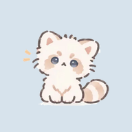

<div align="center">



# 奶团小屋

**一只白色小熊猫，住在你的手机里。**

摸摸它、喂它小鱼、陪它玩小游戏，攒小鱼干给它的窝换上新家具。

### [🐾 点这里直接玩](https://starity777-byte.github.io/naituan/)

手机打开 → 浏览器菜单里「添加到主屏幕」，奶团就会像一个 App 一样住在桌面上。

</div>

<p align="center">
  
  
  
  
  
</p>

## 奶团会做什么

- **摸哪里都有回应**：摸头开心，挠肚子打滚，碰鼻尖眨眼，长按脸颊会蹭蹭你。连着快摸，叫声会一路升高。
- **它有自己的生活**：会饿、会困、会钻纸箱。你不理它时，它会自己在房间里走走停停，去闻闻家具、在窗下发呆。
- **三个小游戏赚小鱼干**
  - 🎵 **躲猫猫**：5 个短关卡加无尽模式，每关是写好的固定谱子。哪个纸箱的盖子先抖一下，下一拍奶团就从那里探头；点中、漏掉、点错、点空，箱子上都有不一样的反馈。插在小棍上、摇摇晃晃的是纸片猫，别点它。
  - 📦 **堆纸箱**：一层一层往上叠，看你能堆多高。
  - 🎂 **猫猫蛋糕店**：40 关排序谜题，19 种猫、16 款蛋糕。后排纸袋猫靠近队首才揭晓，整列进店时其他猫仍能继续移动。后段最多 12 种猫挤在一格周转位里；另有**限时营业**和**无限闯关**，持续生成有解的新棋盘，越往后限时限步越紧、通关奖励越多。
- **给它戴小饰品**：奶团捡到的小白花会跟着它的每个动作一起动，摸头、打滚、走路都戴得稳稳的。
- **布置自己的窝**：日式榻榻米、海边小屋、森林树屋、星月阁楼……近百件手绘家具，可以拖动、缩放、镜像，自由混搭。
- **陪你过日子**：生活页有单词打卡、饮食记录、日历待办和自习室。
- **记得你陪了它多久**：进度存在你自己的浏览器里，也可以导出存档带到别的设备。

## 一起建设奶团小屋 🧶

奶团还在长大，想做但还没做的事情都写在 [Issues](https://github.com/starity777-byte/naituan/issues) 里：更抓人的互动反馈、新小游戏、新饰品、回窝时的新鲜事……

- 有想法、发现 bug：直接开一个 issue 告诉我
- 想动手：挑一个 issue 留言认领，然后提 PR
- 只是喜欢奶团：点一下右上角的 ⭐，就是对它最好的支持

## 一点技术小档案

- 纯静态网页，**没有构建步骤，没有依赖**，下载下来就能跑
- 音效在手机上**现场合成**（`sound.js`）；背景音乐根据阿琳的两段 MIDI 编成轻回应版，主题接低八度、较轻的回应，配规律的轻伴奏；夜晚采用暖电钢琴，晨间「晴窗小步」、午后「蜜糖软垫」、夜晚「月牙摇篮」，在小屋按设备当地时间自动切换，三个小游戏统一播放午后「蜜糖软垫」，退出后接回当前时段，支持无缝循环（`bgm.js` / `assets/music/`）。
- 蛋糕店关卡由脚本倒推生成，保证有解。前 15 关由 **A\* 搜索求解器**（`tools/solver.cpp`）计算最少步数；16–40 关由 `tools/gen_challenge_levels.py` 追加，提供 75 个布局及可重放的解法，显示参考步数，留出探索空间。
- 支持添加到主屏幕，全屏运行

各模块的实现细节、文件说明和换素材的方法，都在 [开发笔记](docs/DEVLOG.md) 里。

## 本地运行

```bash
git clone https://github.com/starity777-byte/naituan.git
cd naituan
python3 -m http.server 8000
```

然后打开 <http://localhost:8000>。注意：本地和线上是不同网址，进度各存一份，可以用「我的 → 存档」导出再导入。

## 许可

- **代码**：[MIT](LICENSE)，欢迎学习、修改和一起建设。
- **奶团的形象和所有美术素材**（`assets/` 目录下的图片与动画）：属于作者本人，保留所有权利，请不要在本项目之外使用，详见 [素材版权说明](assets/LICENSE.md)。

<div align="center">

今天也是好奶团！🐾

</div>
